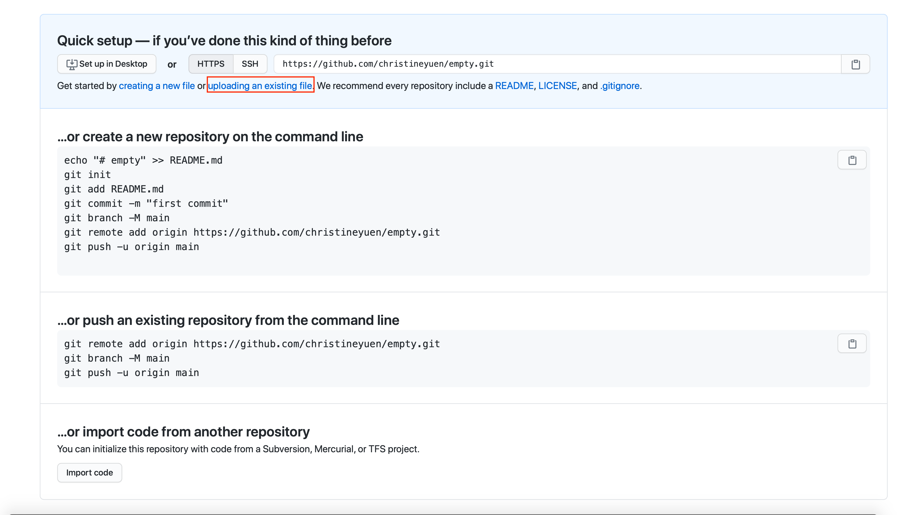
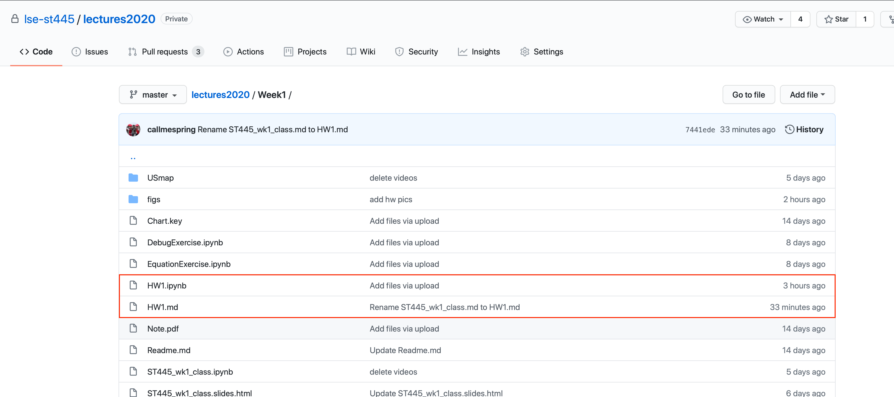

# User-Friendly Guide for Submitting HW1

1. Log in your GitHub account

2. Click the link (or paste the link into your browser) I sent you in the email. You will see the following table and click accept this assignment

3. Then GitHub will automatically generate a repo for you. Importing the starter code might take a while. But sometimes the repo has already been created on GitHub even if it is still “importing” starter code. You can have a check on GitHub (Given in the following steps). After it is done, you will see the following window.

\newpage

4. Go to you GitHub page, click the LSE organization. You will see a repo with 2020mt-st445-hw1-yourname. That’s the repo you will work on. Click that repo.

5. You will see three files in the repo. HW1.ipynb is the notebook file you will be using for submitting HW. HW1.md is the homework assignment. It has a total of 5 problems (Question 5 is optional). Download that repo. Use Jupyter notebook to open HW1.ipynb

\newpage

  * Sometimes GitHub classroom fails to create the repo for you properly and your homework repository may be empty and look like the following:

  

  Please add the homework files by yourself from the "lse-st445/lectures2020" repository by clicking on `uploading an existing file` (red square in the picture above). For hw1, you can find the hw files here:

Note while in Step 4 we show that you should have 3 files, the two files HW1.mod and HW.ipynb are enough for the homework.

\newpage

6. It looks as follows. Q1-3 Should have been finished during the class. Type in ‘Done’ in the cells below them (make them as Markdown cells). For Q4, paste your code into the cell below Q4. For Q5, it is optional. If you have made a personal page, just paste the link of your personal page there and save it as a markdown cell.

